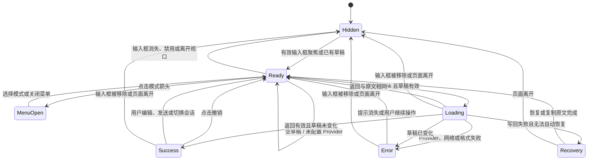
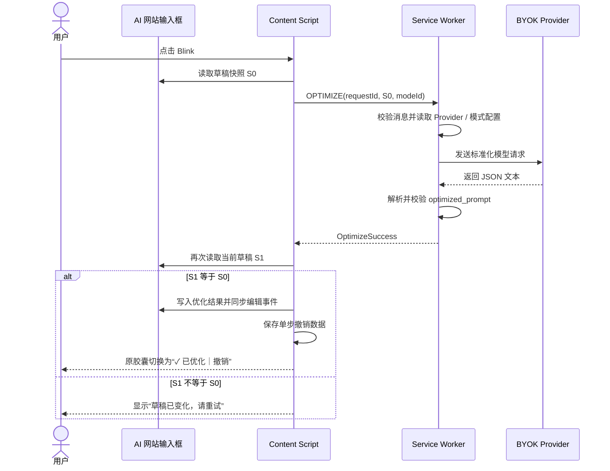
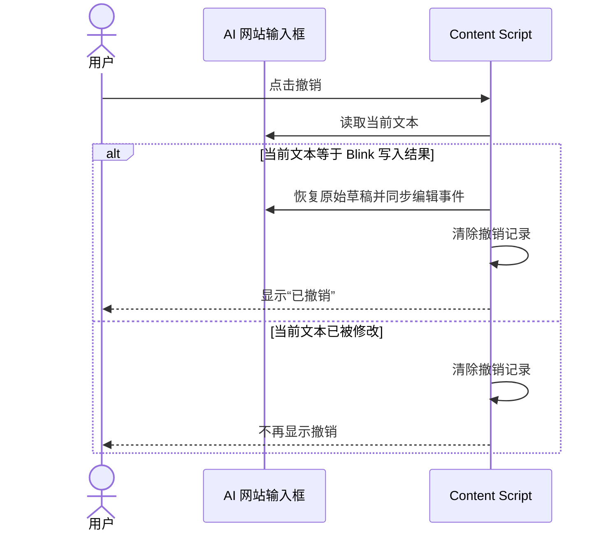
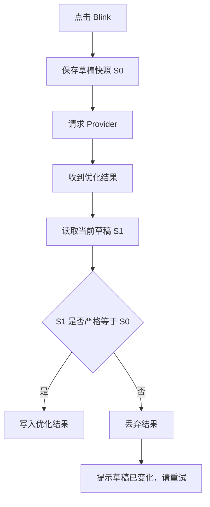
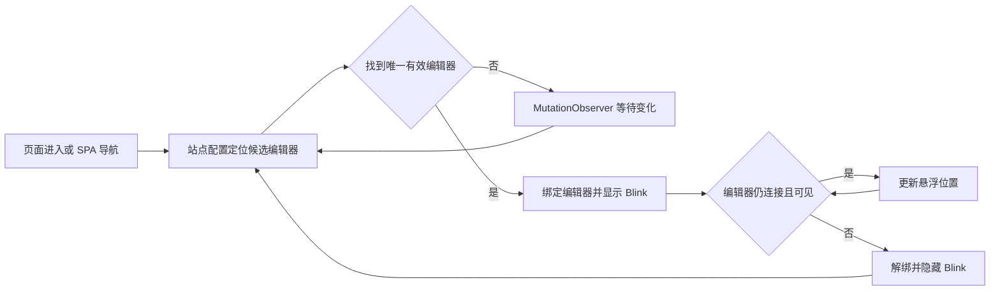
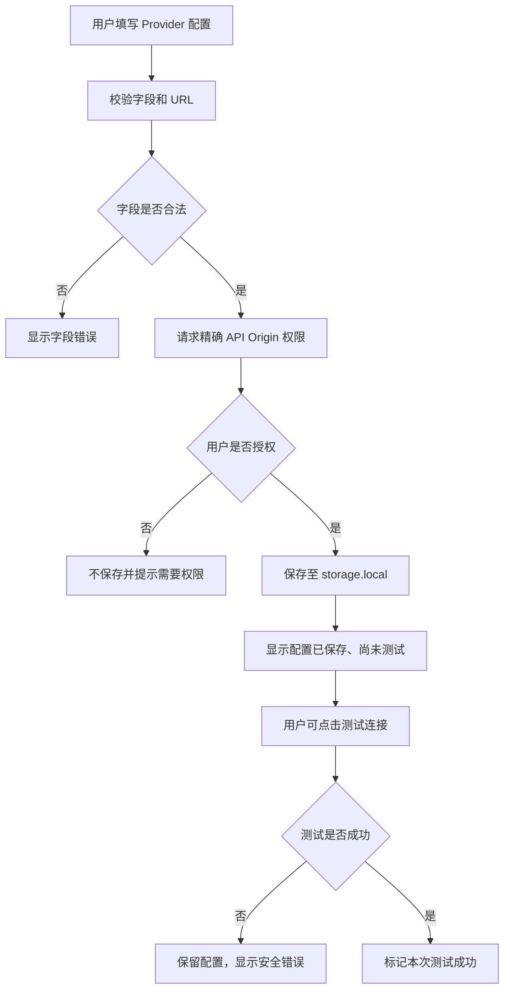

# Blink 状态与交互图

- 状态：P0 设计基线
- 更新日期：2026-08-06
- 相关文档：[精简 PRD](./PRD.md) · [接口与 Prompt 协议](./PROTOCOLS.md)

## 1. 组件状态图

状态含义：

| 状态 | UI | 可执行操作 |
| --- | --- | --- |
| Hidden | 不显示 | 无 |
| Ready | `[✦ Blink] [模式⌄]` | 优化、切换模式 |
| MenuOpen | 模式菜单展开 | 选择模式、关闭菜单 |
| Loading | 加载动画，Blink 按钮禁用 | 用户仍可编辑或发送原草稿 |
| Success | 原胶囊切换为 `[✓ 已优化] [撤销]` | 撤销或继续编辑 |
| Error | 短暂错误提示 | 修正设置或重试 |
| Recovery | 持续显示原文恢复卡 | 恢复输入框或复制原文 |

## 2. 正常优化时序

## 3. 撤销时序

## 4. 草稿竞争保护

比较使用完整字符串严格相等，不做 trim、标准化换行或模糊匹配。任何用户修改都优先于模型结果。

## 5. 输入框生命周期

首版只有站点配置和必要的站点专用写回函数，不实现“全网页候选输入框打分器”。

## 6. 设置 Provider

保存与测试分离：离线时仍可保存有效配置；测试状态只描述最近一次测试结果，不作为长期可用性保证。

## 7. 关键交互规则

### Blink 胶囊

- 左侧主按钮执行当前模式。
- 右侧箭头只打开模式菜单，不立即优化。
- 胶囊固定在整个 Composer 外框右上方 8px，右边缘与包含发送按钮的完整外框对齐并限制在视口内；Composer 高度变化时保持该相对位置，编辑区内部文字滚动时不漂移。
- 输入框空且失焦时隐藏；聚焦或已有草稿时显示。
- 模式菜单使用键盘可访问：方向键移动、Enter 选择、Escape 关闭。
- 加载期间主按钮和模式选择均禁用，避免请求与模式不一致。
- 成功后不弹出第二个成功框；原胶囊左侧显示图标与“已优化”，右侧只保留“撤销”。
- 成功态不能再次优化或调整模式；撤销、用户编辑、发送或切换会话后回到 Ready。

### 提示消息

- 相同结果和普通错误提示在 4 秒后消失。
- “撤销”在失效前持续显示，不使用自动倒计时。
- 设置类错误提供“打开设置”操作。
- 错误提示不得遮挡原网站的发送、附件或语音按钮。

### 焦点

- 打开模式菜单时焦点进入菜单。
- 关闭菜单后焦点返回 Blink 箭头。
- 优化成功、失败或撤销后，焦点返回原输入框。

## 8. 异常路径

| 事件 | 状态变化 | 处理 |
| --- | --- | --- |
| 请求中用户继续输入 | Loading → Error | 丢弃返回结果，不覆盖草稿 |
| 请求中用户发送消息 | Loading → Hidden/Ready | 丢弃返回结果 |
| 请求中切换会话 | Loading → Hidden | 丢弃返回结果 |
| Provider 返回原文 | Loading → Ready | 提示已经足够清晰，不建立撤销 |
| Provider 返回无效 JSON | Loading → Error | 保留原文，不自动重试 |
| 写回后读回不一致 | Loading → Error/Recovery | 自动恢复原文；恢复仍失败则持续展示可复制原文恢复卡 |
| 优化后用户手动编辑 | Success → Ready | 清除撤销记录 |
| 自定义模式被删除 | 任意非 Loading 状态 → Ready | 回退到自动模式 |
| Provider 配置被清除 | Ready → Ready | 点击时引导打开设置 |

## 9. 人工验收路径

每个支持站点至少执行以下七条：

1. 输入文本 → 自动模式 → 成功替换 → 撤销。
2. 输入冗长文本 → 精简模式 → 结果不长于原文且约束完整。
3. 输入宽泛的分析或研究请求 → 自动模式补充分析维度、证据要求和输出结构，但不虚构事实。
4. 输入复杂文本 → 专业模式形成严谨、可核验的任务结构。
5. 请求期间继续打字 → 返回结果不覆盖新草稿。
6. 优化后手动修改 → 撤销消失。
7. 新建对话或切换会话 → Blink 重新定位且旧撤销失效。
